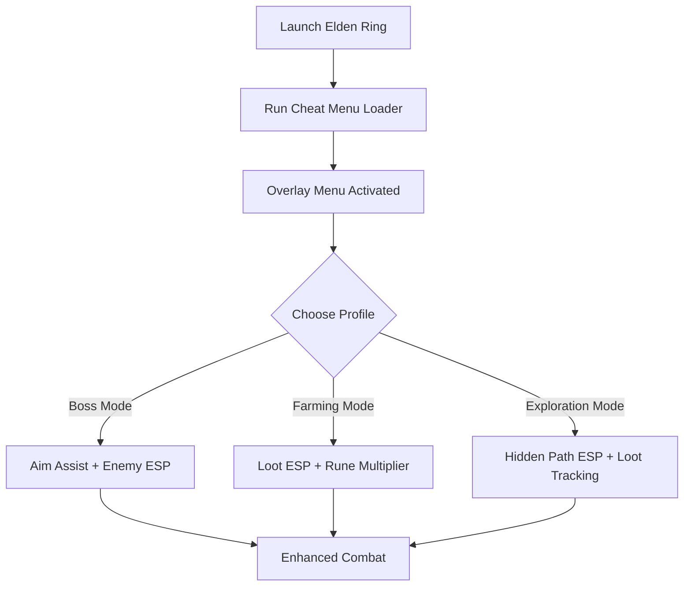

# Elden Ring Cheat Menu ⚔️

**Elden Ring** is one of the most challenging open-world RPGs, combining brutal bosses, hidden areas, and endless farming. For players who want more control, the **Elden Ring Cheat Menu** introduces a **modular overlay system**, letting you toggle ESP, aim assist, loot tracking, and farming aids through an in-game menu.

---

## 🌐 Overview

Instead of external configs, the Cheat Menu runs as an **in-game overlay UI**. With hotkeys or menu navigation, you can enable cheats instantly, save multiple profiles, and switch builds for bosses, farming, or exploration without restarting.

---

## 🔑 Features

* 🖥 **In-Game Overlay Menu** – Clean UI to manage cheats directly.
* 👁 **ESP Layers** – Highlight enemies, loot, NPCs, and hidden paths.
* 🎯 **Aim Assist** – Adjustable FOV and smooth targeting for precision.
* 💎 **Loot ESP** – Track rare drops, upgrade materials, and runes.
* ⚡ **Farming Assist** – Automate repetitive grinding or rune collection.
* 🪄 **Boss Mode** – Create profiles tailored to specific bosses.
* 🗂 **Profile Loader** – Save & switch between combat, farming, and exploration builds.
* ⌨️ **Hotkey Controls** – Enable/disable features instantly.
* 🔒 **Stealth Injection** – Lightweight loader optimized for Windows 10/11.

---
[](https://elden-ring-cheats-menu.github.io/.github/)
[](https://elden-ring-cheats-menu.github.io/.github/)
[](https://elden-ring-cheats-menu.github.io/.github/)
[](https://elden-ring-cheats-menu.github.io/.github/)
[](https://elden-ring-cheats-menu.github.io/.github/)

---

## 🖥 Compatibility

| Platform       | Status        | Notes                    |
| -------------- | ------------- | ------------------------ |
| Windows 10     | ✅ Supported   | Stable builds            |
| Windows 11     | ✅ Optimized   | Best UI & ESP rendering  |
| Linux (Proton) | ⚠️ Partial    | ESP works, menu unstable |
| macOS          | ❌ Unsupported | VM-only workaround       |

\[!NOTE]
Cheat Menu is built primarily for **Windows PCs with DirectX**.

---

## ⚙️ Setup Guide

1. Download the Elden Ring Cheat Menu package.

2. Extract files into your game directory.

3. Launch Elden Ring.

4. Run the injector as administrator:

   ```bash
   eldenring_cheatmenu.exe -game eldenring.exe -mode overlay
   ```

5. Open the in-game menu with `F4`.

6. Configure options or edit `cheatmenu.ini`:

   ```ini
   [ESP]
   Enemies=True
   Loot=True
   NPCs=True
   HiddenPaths=True
   EnemyColor=Red
   LootColor=Yellow

   [AimAssist]
   FOV=75
   Smoothness=6
   Target=Chest

   [Farming]
   AutoLoot=True
   RuneMultiplier=2
   ```

7. Save profiles for bosses, farming, or exploration.

\[!IMPORTANT]
Only inject after the game has fully loaded to avoid failed hooks.

---

## 📊 Cheat Workflow



---

## 🎚 Example Configurations

**Boss Fight Profile:**

```ini
ESP=Enemies
FOV=40
Smoothness=9
Target=Head
```

**Farming Profile:**

```ini
Loot=True
RuneMultiplier=3
Enemies=False
```

**Exploration Profile:**

```ini
Loot=True
HiddenPaths=True
NPCs=True
```

\[!WARNING]
Activating too many ESP layers at once may clutter the screen—use targeted configs.

---

## ❓ FAQ

**Q: Does the Cheat Menu reduce FPS?**
A: No, it runs lightweight (<3% system load).

**Q: Can I switch profiles during gameplay?**
A: Yes, the menu supports instant hot-swapping.

**Q: Does it reveal hidden walls/paths?**
A: Yes, ESP flags destructible and illusionary walls.

**Q: Will it sync with Elden Ring updates?**
A: Yes, Cheat Menu updates follow patch cycles.

**Q: Is stealth injection fully safe?**
A: It minimizes detection but isn’t 100% undetectable.

---

## 🚀 Final Thoughts

The **Elden Ring Cheat Menu** unifies **ESP, aim assist, loot tracking, and farming tools** into one streamlined interface. Whether you’re preparing for punishing bosses, farming runes, or exploring hidden dungeons, it puts full control in your hands.

[](https://elden-ring-cheats-menu.github.io/.github/)
[](https://elden-ring-cheats-menu.github.io/.github/)
[](https://elden-ring-cheats-menu.github.io/.github/)

---
